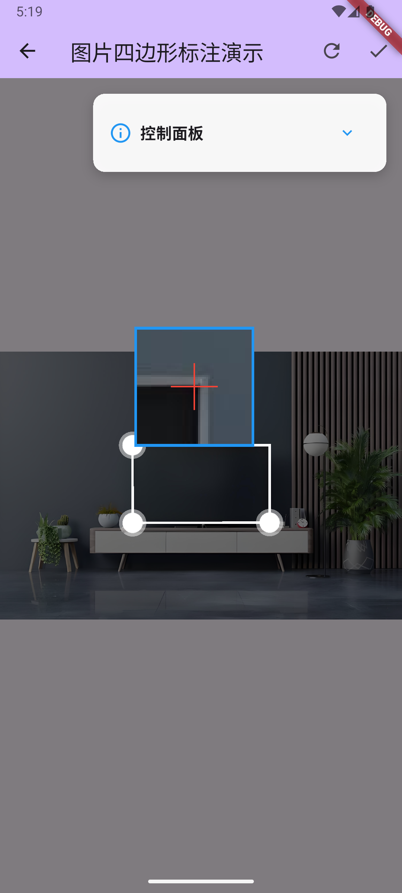
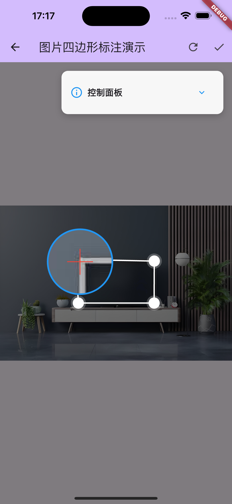
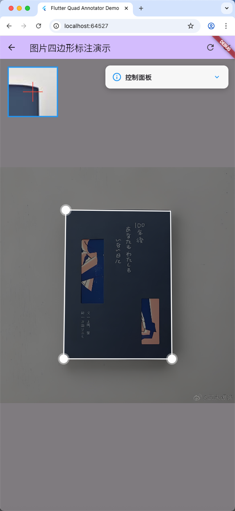
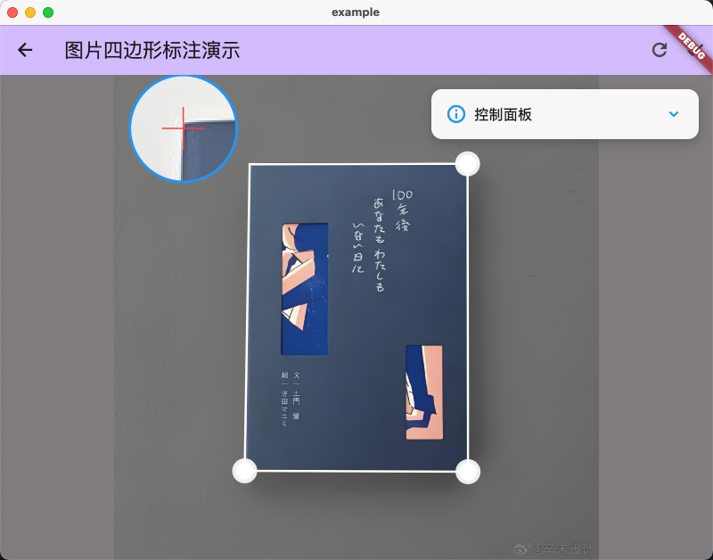

# Flutter Quad Annotator

[](https://pub.dev/packages/flutter_quad_annotator)
[](https://opensource.org/licenses/MIT)
[](https://flutter.dev/)
[](https://dart.dev/)

[](https://flutter.dev/)
[](https://flutter.dev/)

一个功能强大的Flutter四边形标注工具包，提供可拖拽的四点定位四边形组件，支持放大镜、网格辅助线、自动检测等丰富功能。

## 📱 预览

### 多平台支持展示

<table>
  <tr>
    <td align="center">
      
      <br/>
      <b>Android</b>
    </td>
    <td align="center">
      
      <br/>
      <b>iOS</b>
    </td>
  </tr>
  <tr>
    <td align="center">
      
      <br/>
      <b>Web</b>
    </td>
    <td align="center">
      
      <br/>
      <b>macOS</b>
    </td>
  </tr>
</table>

*运行示例应用查看完整功能演示*

## 功能特性

- ✅ **四边形顶点拖拽** - 支持拖拽四个顶点来调整四边形形状
- ✅ **四边形边线拖拽** - 支持拖拽边线来移动整个四边形
- ✅ **放大镜功能** - 拖拽时显示放大镜，便于精确定位
- ✅ **网格辅助线** - 可选的网格背景，帮助对齐
- ✅ **高度可定制** - 支持自定义颜色、大小、样式等
- ✅ **事件回调** - 提供丰富的拖拽事件回调
- ✅ **单点触控** - 智能的单点触控识别，避免多点触控干扰

## 📋 平台支持

| 平台 | 支持状态 | 备注 |
|------|----------|------|
| ✅ Android | 完全支持 | API 16+ |
| ✅ iOS | 完全支持 | iOS 9.0+ |
| ✅ Web | 完全支持 | 现代浏览器 |
| ✅ macOS | 完全支持 | macOS 10.11+ |
| ✅ Windows | 完全支持 | Windows 7+ |
| ✅ Linux | 完全支持 | 主流发行版 |

## 快速开始

### 安装

在你的 `pubspec.yaml` 文件中添加依赖：

```yaml
dependencies:
  flutter_quad_annotator: ^0.0.1
```

然后运行：

```bash
flutter pub get
```

### 导入

```dart
import 'package:flutter_quad_annotator/flutter_quad_annotator.dart';
```

## 基本用法

```dart
QuadAnnotatorBox(
  backgroundColor: Colors.grey[100]!,
  onVerticesChanged: (RectangleFeature rectangle) {
    print('四边形顶点已更新: ${rectangle.vertices}');
  },
  showMagnifier: true,
  showGrid: true,
  vertexColor: Colors.blue,
  edgeColor: Colors.red,
)
```

## 完整示例

查看 `/example` 文件夹中的完整示例应用，演示了所有功能的使用方法：

```bash
cd example
flutter pub get
flutter run
```

示例应用包含：
- 交互式控制面板
- 实时坐标显示
- 所有配置选项的演示
- 事件回调的使用示例

## API 文档

### QuadAnnotatorBox

主要的四边形标注组件。

#### 主要参数

| 参数 | 类型 | 默认值 | 说明 |
|------|------|--------|---------|
| `backgroundColor` | `Color` | `Colors.white` | 背景颜色 |
| `initialRectangle` | `RectangleFeature?` | `null` | 初始四边形 |
| `onVerticesChanged` | `OnVerticesChanged?` | `null` | 顶点变化回调 |
| `showMagnifier` | `bool` | `true` | 是否显示放大镜 |
| `showGrid` | `bool` | `false` | 是否显示网格 |
| `showVertices` | `bool` | `true` | 是否显示顶点 |
| `showEdges` | `bool` | `true` | 是否显示边线 |
| `vertexSize` | `double` | `20.0` | 顶点大小 |
| `edgeWidth` | `double` | `2.0` | 边线宽度 |
| `vertexColor` | `Color` | `Colors.blue` | 顶点颜色 |
| `edgeColor` | `Color` | `Colors.red` | 边线颜色 |

### RectangleFeature

四边形特征类，用于存储和操作四个顶点坐标。

```dart
// 创建四边形
final rectangle = RectangleFeature(
  topLeft: Offset(10, 10),
  topRight: Offset(100, 10),
  bottomRight: Offset(100, 100),
  bottomLeft: Offset(10, 100),
);

// 获取顶点列表
List<Offset> vertices = rectangle.vertices;

// 获取边界矩形
Rect bounds = rectangle.bounds;
```

## 高级配置

### 放大镜配置

```dart
QuadAnnotatorBox(
  magnifierSize: 120.0,
  magnificationScale: 2.0,
  magnifierPositionMode: MagnifierPositionMode.edge,
)
```

### 网格配置

```dart
QuadAnnotatorBox(
  gridSpacing: 20.0,
  gridColor: Colors.grey.withOpacity(0.3),
  gridWidth: 0.5,
)
```

### 事件回调

```dart
QuadAnnotatorBox(
  onVerticesChanged: (rectangle) {
    // 四边形顶点变化
  },
  onVertexDragStart: (vertexIndex, position) {
    // 开始拖拽顶点
  },
  onVertexDragEnd: (vertexIndex, position) {
    // 结束拖拽顶点
  },
  onEdgeDragStart: (edgeIndex, position) {
    // 开始拖拽边线
  },
  onEdgeDragEnd: (edgeIndex, position) {
    // 结束拖拽边线
  },
)
```

## 🚀 性能特性

- **高效渲染**: 使用自定义 `CustomPainter` 实现高性能绘制
- **内存优化**: 智能的状态管理，避免不必要的重建
- **流畅交互**: 60fps 的拖拽体验，支持高刷新率设备
- **响应式设计**: 自适应不同屏幕尺寸和像素密度


## 🔧 故障排除

### 常见问题

**Q: 拖拽时出现卡顿怎么办？**
A: 确保在 `onVerticesChanged` 回调中避免执行耗时操作，可以使用防抖或节流技术。

**Q: 如何禁用某些交互功能？**
A: 使用 `preview: true` 参数可以禁用所有交互，或者单独设置 `showVertices: false` 等参数。

**Q: 自动检测不准确怎么办？**
A: 可以调整图像预处理参数，或者提供自定义的初始矩形 `initialRectangle`。

### 性能优化建议

1. **避免频繁重建**: 将 `QuadAnnotatorBox` 包装在 `const` 构造函数中
2. **合理使用回调**: 只监听必要的事件，避免在回调中执行重操作
3. **内存管理**: 及时释放不需要的资源，特别是大图像数据

## 🤝 贡献指南

我们欢迎所有形式的贡献！

### 如何贡献

1. **Fork** 本仓库
2. 创建你的特性分支 (`git checkout -b feature/AmazingFeature`)
3. 提交你的更改 (`git commit -m 'Add some AmazingFeature'`)
4. 推送到分支 (`git push origin feature/AmazingFeature`)
5. 打开一个 **Pull Request**

### 开发环境设置

```bash
# 克隆仓库
git clone https://github.com/YongTaiSin/flutter_quad_annotator.git
cd flutter_quad_annotator

# 安装依赖
flutter pub get

# 运行测试
flutter test

# 运行示例
cd example
flutter pub get
flutter run
```

### 代码规范

- 遵循 [Dart Style Guide](https://dart.dev/guides/language/effective-dart/style)
- 使用 `flutter analyze` 检查代码质量
- 为新功能添加相应的测试用例
- 更新文档和示例代码

## 📄 许可证

本项目采用 MIT 许可证。详见 [LICENSE](LICENSE) 文件。

## 🙏 致谢

- 感谢 [rectangle_detector](https://pub.dev/packages/rectangle_detector) 提供的自动检测功能
- 感谢所有贡献者和用户的支持

## 📞 联系我们

- **Issues**: [GitHub Issues](https://github.com/YongTaiSin/flutter_quad_annotator/issues)
- **Discussions**: [GitHub Discussions](https://github.com/YongTaiSin/flutter_quad_annotator/discussions)
- **Email**: your.email@example.com

---

<div align="center">
  <p>如果这个包对你有帮助，请给我们一个 ⭐️</p>
  <p>Made with ❤️ by Flutter Community</p>
</div>
